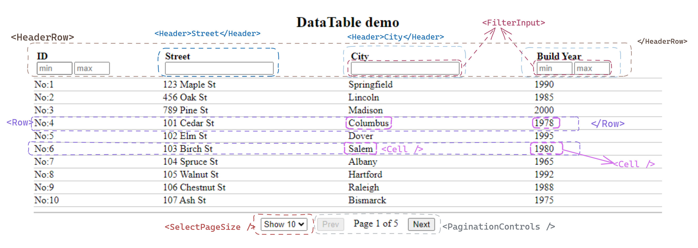

# UI Components project
  - I wanted to build most of the standard UI components, commonly used in web applications, such as Tabs, Accordion, ModalDialog, using React.
  - This repo is a collection of components built for practice and to expand my knowledge
  - There are lots of accessibility challenges that I stumbled upon and handled while building these components.
  - I have captured those learnings for each component & documented them inside the respective component folders.

## Which components will be included:
  I have planned to include the following components (the list could grow if I find more exciting things to build):
  - `DataTable` component
  - `Tabs` component
  - `Accordion` component
  - `AuthCodeInput` (OTPInput) 
  - `ModalDialog`

## Notes:
  I have also shared my solution approach for building each component and the lessons learned while building it.

 1. `DataTable` component:
     - breakdown: `<HeaderRow>`, `<Row>`, `<SelectPageSize />`, `<Pagination>` smaller components 👇
      

https://github.com/user-attachments/assets/7a51696e-6576-4d84-a570-926bc94c940e

 2. `Tabs` component breakdown:
    - `<TabList>` contains multiple `<Tab>` elements (which can be clicked to display respective panel) 
    - a Tab can be clicked to see the associated `TabPanel`
      - as `Tab` is an interactive clickable element, hence using `button` is good for accessibility.
    - `<TabPanel>` contains contents for a specific tab (only the active-tab is displayed at a time)
  
 

 3. `AuthCodeInput` component breakdown:
  

    - renders six `<Digit />` components (number of digits can be controlled using `length` prop, default is 6)
    - initially focus on first `<Digit>` (`focusIndex=0`)
    - once user enters valid value in `<Digit>`, then the focus moves to next digit
    - pressing `Backspace` key will clear the `<Digit>` value & then move to previous digit
  
 

