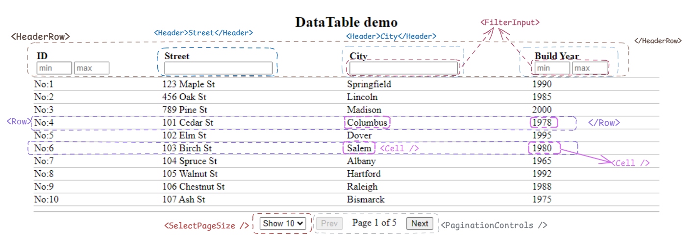

1. `DataTable` component breakdown:
  -  `<HeaderRow>`, `<Row>`, `<SelectPageSize />`, `<Pagination>` smaller components 👇
 

## Learnings from this challenge
 - `sort(compareFn)` method mutates the array, if you don't want to mutate then `toSorted()` will be useful
 - in `compareFn(a,b)` you can compare string or number using `a < b ? -1 : a > b ? 1 : 0`
   - its better to use `str1.localeCompare(str2)` for string comparisons
 - writing your solution in TS, helps you revise the concepts & reinforce those.
 - changing the sortColumn should reset sortDirection to ASC (instead of using the previously selected direction)

## Notes
 - first sort `allRecords` & then slice out current page rows from `sortedRecords`

## Other notes/observations for better UX:
 - whenever `pageSize` is changed we need to reset `currentPage=0` (code goes in `handlePageSizeChange` handler)
   - otherwise if user is on page-4 and then changes pageSize to higher number then there is chance that there will not be page-4, so no rows will be shown
 - there are no side-effects right now (in the current requirements)
 - disable the next/prev buttons when its not possible to move prev/next for eg: first page, last page
 - if `sortInfo` changes then should we reset current-page to first page ? for better UX

## Approach for DataTable:
  ### state & values that can be derived
```js
function DataTable(){
  state = {
    pageSize: 5,
    page: 0,
  }
 
 // values which can be derived 
  const totalPages = rows.length/pageSize
  const start = page * pageSize;
  const end = start + pageSize;
 
  // rows to be displayed for current page
  const rows = data.slice(start, end)

  return (
    // jsx here
  )
}

```
```tsx
  const COLUMNS = [
    {
      id: 'id',
      label: 'Id',
      // by default DataTable will pick row[columnId] to display value
      // renderCell(row) { return row.primaryId},

      
      // comparator func for each column will be defined by consumer of DataTable
      comparator:(a, b, order) => {
        // sorting logic here
        const [aVal, bVal] = [a[id], b[id]]
        return order === 'ASC' ? aVal - bVal : bVal - aVal;

        // or we can use aVal.localeCompare(bVal) for string comparison
      }

    },
    {
      id: 'name',
      label: 'Name'
    },
    // age, occupation
  ]

 <DataTable columns={columns} data={rows} pageSize={5} />

 <DataTable columns={columnsDefs} records={data} />

const filters = {
     street: {type: 'string', value: 'Ber'},
     built_year: {type: 'range', value: {min: 1990, max: 2012}},
   }
   
type Filter = Record<keyof T, {type: FilterType, value: string | {min: number, max: number}}>;

 <HeaderFilterInput column={col} filter={filter} />;
```

## sorting fns
```js
function sortNumber(a, b){
  return a-b
}

function sortStrings(a, b){
  return a.localeCompare(b)
}
```